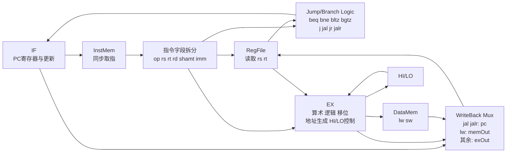
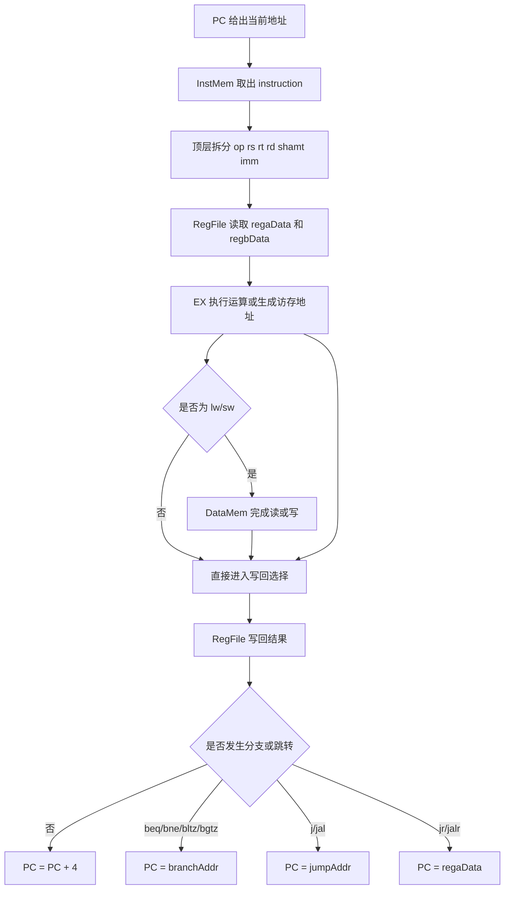
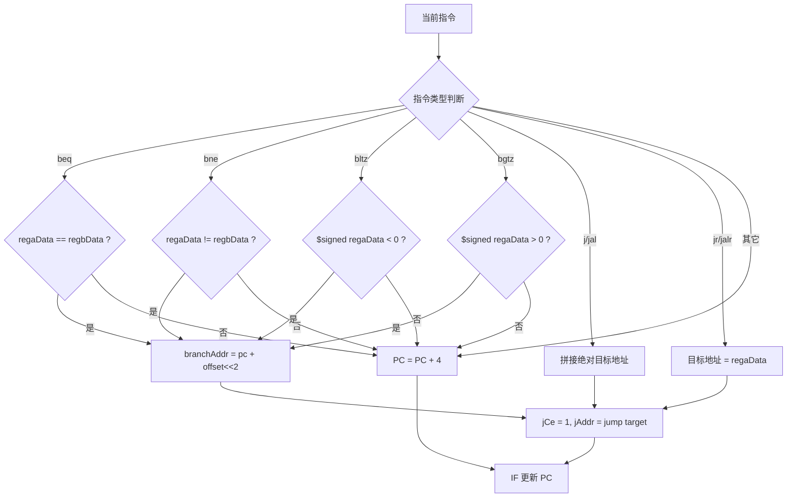
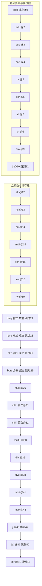

# MIPS 模型机工程连线图（20 条基本整数指令 + 12 条扩展整数指令版）

## 本版工程重点
本版围绕 **20 条 MIPS 基本整数指令** 和 **12 条 MIPS 扩展整数指令** 重新整理了测试流，并补齐了以下关键路径：
- `beq` / `bne` / `bltz` / `bgtz` 分支控制
- `j` / `jal` / `jr` / `jalr` 跳转控制
- `andi` / `ori` / `xori` 的零扩展
- `lw` / `sw` 的有效地址计算
- `mult` / `multu` / `div` / `divu` 的 HI/LO 更新路径
- `mfhi` / `mflo` / `mthi` / `mtlo` 的 HI/LO 读写路径
- `RegFile` 复位清零
- `testbench` 自动结束，避免人工 `stop`

## 工程连线总览

## 模块级连线说明

### 1. `IF` 模块
- 输入：`clk`、`rst`、`eret`、`epc`、`jCe`、`jAddr`
- 输出：`pc`、`romCe`
- 作用：更新程序计数器，决定下一条指令地址。
- 本版真正使用到的 PC 更新方式有：
  - 顺序执行：`pc + 4`
  - 条件分支：`beq`、`bne`、`bltz`、`bgtz`
  - 绝对跳转：`j`、`jal`
  - 寄存器跳转：`jr`、`jalr`

### 2. `InstMem` 模块
- 输入：`pc`
- 输出：`instruction`
- 作用：根据地址输出机器码。
- 本版把 `instmem` 和内部演示 `datamem` 都初始化成 `0`，所以即使程序跑过结尾，后续也只会读到 `nop`，不会出现未初始化杂波。

### 3. 顶层字段拆分与控制转移判断
`MIPS.v` 顶层先拆出：
- `op = instruction[31:26]`
- `rs = instruction[25:21]`
- `rt = instruction[20:16]`
- `rd = instruction[15:11]`
- `shamt = instruction[10:6]`
- `imm = sign_extend(instruction[15:0])`

然后在顶层直接完成控制流判断：
- `beq_taken = (regaData == regbData)`
- `bne_taken = (regaData != regbData)`
- `bltz_taken = ($signed(regaData) < 0)`
- `bgtz_taken = ($signed(regaData) > 0)`

`jAddr` 的来源分为三类：
- `j/jal`：`{pc[31:28], instruction[25:0], 2'b00}`
- `beq/bne/bltz/bgtz`：`pc + (offset << 2)`
- `jr/jalr`：寄存器 `regaData`

这说明：
- 分支比较是在顶层完成的；
- `IF` 模块只负责根据 `jCe/jAddr` 真正更新 PC。

## 指令执行流程图

## EX 模块内部数据路径说明
### 1. 普通 ALU 路径
- `add`、`sub`
- `and`、`or`、`xor`
- `sll`、`srl`、`sra`
- `slt`
- `addi`、`andi`、`ori`、`xori`、`lui`

这些指令都在 `EX` 内直接形成 `exOut`，然后在写回阶段写回寄存器堆。

### 2. 访存地址生成路径
- `lw`、`sw` 在 `EX` 中先形成 `regaData + imm`
- 地址通过 `exOut` 送到 `DataMem`
- `lw` 的读出数据为 `memOut`
- `sw` 的写入数据来自 `regbData`

### 3. HI/LO 路径
- `mult`、`multu` 更新 `HI/LO`
- `div`、`divu` 更新 `HI/LO`
- `mthi` 把寄存器值写入 `HI`
- `mtlo` 把寄存器值写入 `LO`
- `mfhi` 把 `HI` 读到通用寄存器
- `mflo` 把 `LO` 读到通用寄存器

因此，扩展整数指令里最重要的新增通路，就是 **通用寄存器 <-> EX <-> HI/LO** 这条路径。

## 写回选择器 `writeData`
当前工程的写回优先级可概括为：
1. `jal / jalr`：写回 `pc`
2. `lw / ll`：写回 `memOut`
3. 其它普通运算与 `mfhi/mflo`：写回 `exOut`

所以在本版演示中：
- `jal` 会把链接地址写入 `$31`
- `jalr` 会把链接地址写入它指定的目的寄存器
- `lw` 会把访存结果写入目的寄存器
- `mfhi/mflo` 会把 `HI/LO` 的值通过 `exOut` 写回通用寄存器

## 本版控制流连线图

## 32 类指令覆盖顺序图（附实际执行索引）
> 说明：下面先按课程设计要求，给出 **32 类指令** 在本程序中的首次覆盖顺序；再给出 **实际执行索引顺序**。其中 `addi`、`mflo`、`mfhi` 在程序里有多次出现，所以“首次覆盖顺序”和“逐拍实际执行顺序”并不完全相同。

### 1. 32 类指令首次覆盖顺序图

### 2. 实际执行索引顺序
`0 -> 1 -> 2 -> 3 -> 4 -> 5 -> 6 -> 7 -> 8 -> 9 -> 10 -> 12 -> 13 -> 14 -> 15 -> 16 -> 17 -> 18 -> 19 -> 20 -> 22 -> 24 -> 25 -> 27 -> 28 -> 30 -> 31 -> 32 -> 33 -> 34 -> 35 -> 36 -> 37 -> 38 -> 39 -> 40 -> 41 -> 42 -> 43 -> 44 -> 45 -> 47 -> 50 -> 51 -> 54`

### 3. 答辩时可以这样解释
- 前 `10` 条主要完成基础运算和移位；
- `jr` 把执行流从索引 `10` 直接带到索引 `12`；
- `beq/bne/bltz/bgtz` 都是“条件成立后跳过一个 `nop`”；
- `mult/div/mthi/mtlo` 负责写 `HI/LO`，`mfhi/mflo` 负责把结果读回；
- 最后通过 `j -> jal -> jalr` 串起三种跳转方式，并落到索引 `54` 的结束标志指令。

## 推荐答辩时这样解释连线
1. **先讲主干**：`IF -> InstMem -> RegFile/译码 -> EX -> DataMem -> WriteBack -> RegFile`。
2. **再讲控制流**：`beq/bne/bltz/bgtz/j/jal/jr/jalr` 不在 `IF` 里自己判断，而是在顶层先算好 `jCe/jAddr`，再送回 `IF`。
3. **再讲扩展指令**：`mult/div/mthi/mtlo/mfhi/mflo` 都依赖 HI/LO 通路，这是和 20 条基本指令相比最明显的扩展部分。
4. **最后讲本次改动**：我不仅改了测试参数，还把分支控制、逻辑立即数、访存地址和 HI/LO 相关测试全部补全了，所以这版可以完整覆盖 20+12 条整数指令。

## 调试时推荐观察顺序
1. 看 `mips0.pc` 和 `mips0.instruction` 是否按预期前进。
2. 看 `mips0.regaData`、`mips0.regbData` 是否取到正确源操作数。
3. 看 `mips0.exOut` 是否得到正确 ALU 结果或地址。
4. 看 `mips0.Hi`、`mips0.Lo` 是否在 `mult/div/mthi/mtlo` 后正确变化。
5. 看 `mips0.memOut` 与 `mips0.dm.ram[11]` 是否完成一次写后再读。
6. 看 `$31` 和 `jalr` 的目的寄存器是否得到正确链接地址。
